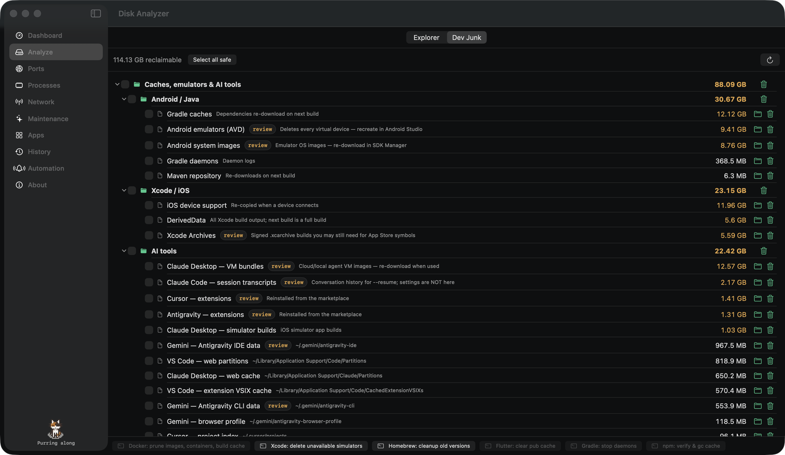
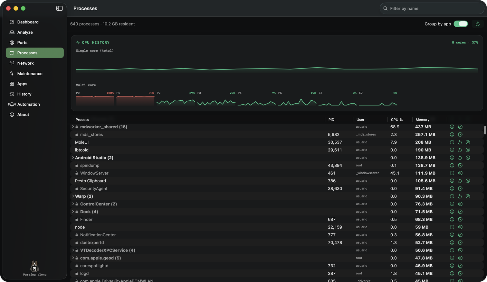
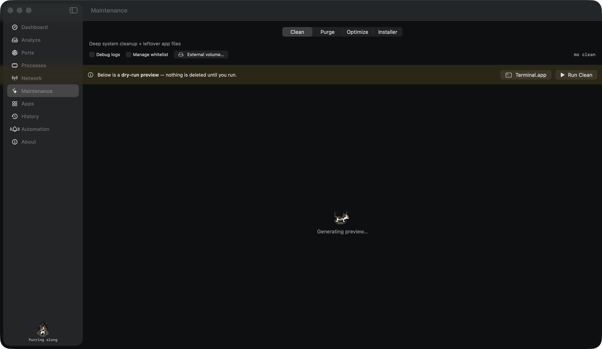
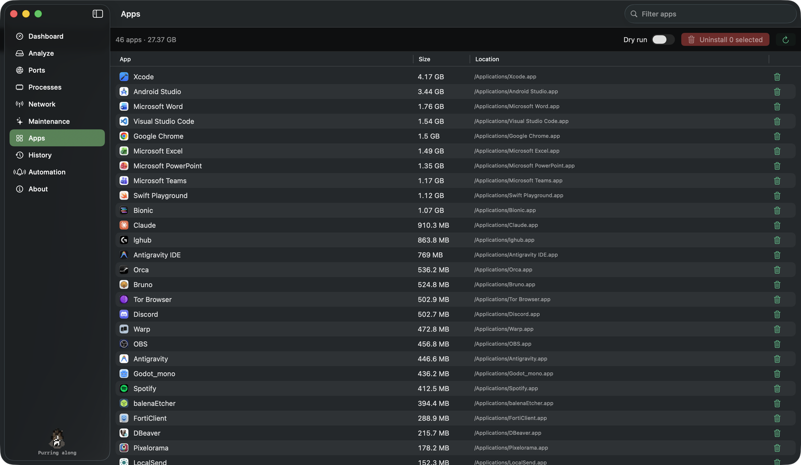
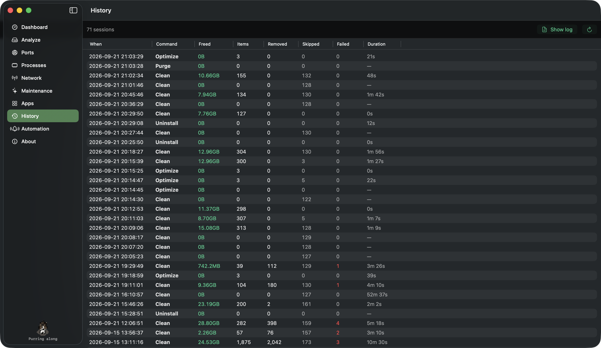
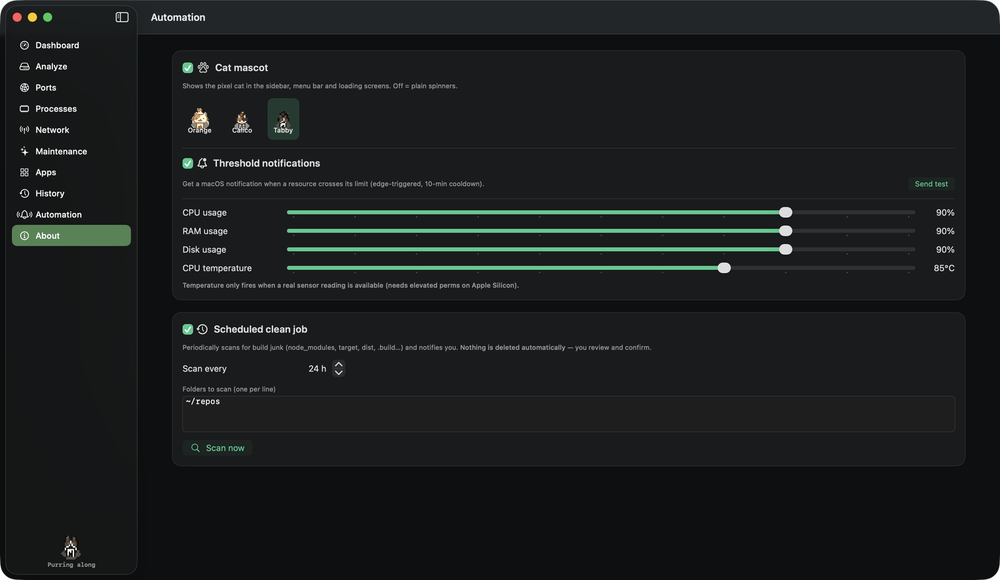

<div align="center">
  
  <h1>MoleUI</h1>
  <p><strong>A native macOS interface for the <a href="https://github.com/tw93/mole">Mole</a> maintenance CLI.</strong></p>
  <p>
    
    
    
  </p>
  
</div>

---

## Powered by Mole

MoleUI is a **graphical front end** — all the system analysis and cleanup is done by
**[Mole (`mo`)](https://github.com/tw93/mole)**, the excellent open-source maintenance
tool by **[tw93](https://github.com/tw93)**. This app just presents its output with a
native SwiftUI interface. **Full credit for the underlying engine goes to the Mole
project and its community.**

MoleUI is independent, **free, and non-commercial** — built for the community. It is not
affiliated with or endorsed by the Mole project.

## Features

- **Dashboard** — live system status (2.5s polling): health score, per-core CPU, memory
  & swap, disks with SMART, network interfaces, and top processes. Every card and process
  has a detail view. CPU history charts (total + per core). The Fan card switches the
  thermal profile — **Silent / Auto / Full** — through macOS power modes (`pmset`).
- **Disk Analyzer** — visual, drill-down explorer of what's using your disk, with
  `cleanable` badges and move-to-Trash.
- **Dev Junk** (Analyze › Dev Junk) — a tree of everything developers accumulate, with
  sizes, checkboxes and multi-select → Trash:
  - **Tool caches & emulators**: Gradle / Maven, Android AVDs & system images, Xcode
    DerivedData / Archives / device support / simulators, pub-cache, npm / yarn / pnpm,
    Playwright, NuGet, pip / uv, CocoaPods, Homebrew, Go, Cargo…
  - **AI-tool data**: Claude Code transcripts & snapshots, Claude Desktop VM bundles and
    caches, Codex, Cursor, Antigravity / Gemini, Orca, VS Code, JetBrains — only the
    disposable sub-folders, never settings or credentials.
  - **Per-project build output** under your scan roots: `node_modules`, `.next`, `dist`,
    `build`, `target`, `.dart_tool`, `Pods`, `bin`/`obj` (.NET only), `__pycache__`,
    `.venv`, plus `*.apk` / `*.aab` / `*.ipa` / `*.xcarchive` / `*.dSYM`.
  - Items that are slow to rebuild or hold state carry a **review** badge; *Select all safe*
    picks everything else. One-click `docker system prune`, `simctl delete unavailable`,
    `brew cleanup`, `dart pub cache clean`… run in the embedded terminal.
- **Ports** — every listening local port (dev servers included), with per-process detail
  and a kill action. Common dev ports are highlighted.
- **Processes** — every process sorted by resident memory, grouped by `.app` bundle
  (expandable), with search, pin-to-top, per-process detail, restart, and Stop / Force Kill.
  System processes are flagged 🔒; killing one owned by root asks for your admin password
  through macOS's own dialog. CPU history charts (total + per core) sit on top.
- **Network** — which apps are consuming bandwidth *right now* (live rate via `nettop`),
  their active connections (`lsof`), and a kill action.
- **Maintenance** — `clean` / `purge` / `optimize` / `installer` with a dry-run preview,
  per-command options (`--yes`, `--include-empty`, `--external <volume>`, …) and a real
  **embedded terminal** so Mole's interactive TUI and sudo prompt run inside the app.
  Terminal.app hand-off is still there as a fallback.
- **Apps** — installed applications with real on-disk sizes; select one or many and run
  `mo uninstall` (leftovers included) in the embedded terminal.
- **History** — every Mole session (`mo history --json`): space freed, items, removed /
  skipped / failed, duration, with a shortcut to the log.
- **Touch ID for sudo** — enable / disable `mo touchid` from the About screen.
- **Automation**
  - **Threshold notifications** — native alerts when CPU / RAM / disk / temperature cross
    user-configurable limits (edge-triggered, with a cooldown).
  - **Scheduled clean job** — periodically scans configured folders for build junk
    (`node_modules`, `target`, `dist`, `.build`, …) and notifies you. **Nothing is deleted
    automatically** — you review the list and confirm; deletions go to the Trash.
- **Menu-bar monitor** — a live gauge in the menu bar with a popover (health, CPU, RAM,
  disk) and quick actions, so monitoring keeps running in the background.
- **JSON snapshot** — export a full audit snapshot (system status + listening ports).
- **Pixel cat mascot** — a little cat in the sidebar and menu bar that naps when the
  system is quiet, sits when it's busy and hisses when CPU / RAM / disk are pegged. Click
  it to pet it. Three skins; can be turned off in Automation.

## Screenshots

| Dev Junk | Dashboard |
|---|---|
|  |  |

| Processes | Maintenance (embedded terminal) |
|---|---|
|  |  |

| Apps (uninstall) | History |
|---|---|
|  |  |

| Automation |
|---|
|  |

## Requirements

- **macOS 14 (Sonoma)** or later
- The **Mole CLI** (`mo`). Install with Homebrew:
  ```bash
  brew install mole
  ```
  (MoleUI detects it, and its onboarding will help you install it if it's missing.)

## Build & run

Open in Xcode:

```bash
open MoleUI.xcodeproj
```

…or build from the command line:

```bash
xcodebuild -project MoleUI.xcodeproj -scheme MoleUI -configuration Debug build
open -n ~/Library/Developer/Xcode/DerivedData/MoleUI-*/Build/Products/Debug/MoleUI.app
```

> **App Sandbox is disabled** on purpose — MoleUI needs to spawn the `mo` binary and read
> the filesystem for disk analysis. Full Disk Access is a permission you grant in System
> Settings; the app only detects and guides you to it.

## Architecture

Modular **MVVM** with Swift Concurrency:

- `Services/ProcessRunner` — the single `async` `Process` primitive (deadlock-safe pipe draining).
- `Services/MoleService` — typed wrappers over `mo status/analyze --json` (snake_case decoding).
- `Services/PortsService`, `NetworkService`, `CleanupService` — native `lsof` / `ps` / `nettop` / `find`.
- `Services/DevJunkService` — static catalog of known junk locations + batched `du`; add a line to
  `catalog` when a new tool shows up.
- `Services/PowerModeService` — `pmset` power modes behind the Fan card (Apple Silicon has no fan API).
- `Views/Shared/EmbeddedTerminal` — [SwiftTerm](https://github.com/migueldeicaza/SwiftTerm) PTY that runs
  Mole's interactive TUIs (`clean`, `purge`, `optimize`, `uninstall`, `touchid`) inside the app.
  Pinned to 1.10.0 — later versions need the Metal toolchain and a build plugin.
- `Services/TerminalHandoff` — Terminal.app fallback for the same commands.
- `Views/Shared/PixelCat` — the sprite-strip mascot (`TimelineView` + `interpolation(.none)`, no animation library).
- One shared status poller feeds both the window and the menu-bar monitor.

The Xcode project file is **generated** from the source tree (including the SwiftTerm
package reference) — after adding or removing files, regenerate it:

```bash
python3 scripts/genproj.py     # regenerates MoleUI.xcodeproj/project.pbxproj
python3 scripts/genicon.py     # regenerates the app icon from the mole SVG
```

## Contributing

Issues and PRs are welcome — this is a community project. Please keep the credit to the
upstream Mole project intact (it's the engine that makes this useful).

## License

**GPL-3.0** — the same license as [Mole](https://github.com/tw93/mole). See [LICENSE](LICENSE).

## Credits

- **[Mole](https://github.com/tw93/mole)** by **[tw93](https://github.com/tw93)** — the CLI engine that powers everything here.
- **GUI** by **[Mangel (MangelSP)](https://github.com/MangelSP)** — [portfolio](https://mangeldev.vercel.app/).
