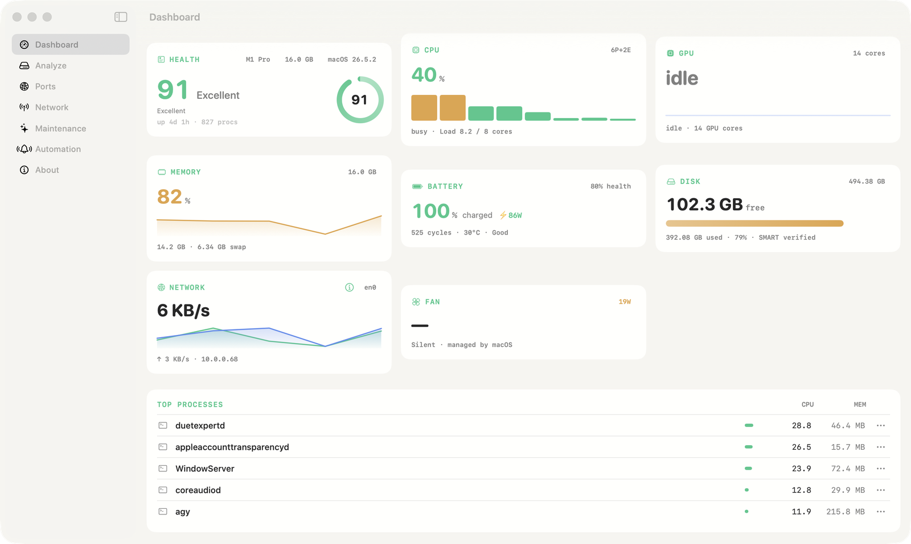

<div align="center">
  
  <h1>MoleUI</h1>
  <p><strong>A native macOS interface for the <a href="https://github.com/tw93/mole">Mole</a> maintenance CLI.</strong></p>
  <p>
    
    
    
  </p>
  
</div>

---

## Powered by Mole

MoleUI is a **graphical front end** — all the system analysis and cleanup is done by
**[Mole (`mo`)](https://github.com/tw93/mole)**, the excellent open-source maintenance
tool by **[tw93](https://github.com/tw93)**. This app just presents its output with a
native SwiftUI interface. **Full credit for the underlying engine goes to the Mole
project and its community.**

MoleUI is independent, **free, and non-commercial** — built for the community. It is not
affiliated with or endorsed by the Mole project.

## Features

- **Dashboard** — live system status (2.5s polling): health score, per-core CPU, memory
  & swap, disks with SMART, network interfaces, and top processes. Every card and process
  has a detail view.
- **Disk Analyzer** — visual, drill-down explorer of what's using your disk, with
  `cleanable` badges and move-to-Trash.
- **Ports** — every listening local port (dev servers included), with per-process detail
  and a kill action. Common dev ports are highlighted.
- **Network** — which apps are consuming bandwidth *right now* (live rate via `nettop`),
  their active connections (`lsof`), and a kill action.
- **Maintenance** — dry-run previews for `clean` / `purge` / `optimize`; the real
  interactive commands are handed off to Terminal (they own their own TUI).
- **Automation**
  - **Threshold notifications** — native alerts when CPU / RAM / disk / temperature cross
    user-configurable limits (edge-triggered, with a cooldown).
  - **Scheduled clean job** — periodically scans configured folders for build junk
    (`node_modules`, `target`, `dist`, `.build`, …) and notifies you. **Nothing is deleted
    automatically** — you review the list and confirm; deletions go to the Trash.
- **Menu-bar monitor** — a live gauge in the menu bar with a popover (health, CPU, RAM,
  disk) and quick actions, so monitoring keeps running in the background.
- **JSON snapshot** — export a full audit snapshot (system status + listening ports).

## Requirements

- **macOS 14 (Sonoma)** or later
- The **Mole CLI** (`mo`). Install with Homebrew:
  ```bash
  brew install mole
  ```
  (MoleUI detects it, and its onboarding will help you install it if it's missing.)

## Build & run

Open in Xcode:

```bash
open MoleUI.xcodeproj
```

…or build from the command line:

```bash
xcodebuild -project MoleUI.xcodeproj -scheme MoleUI -configuration Debug build
open -n ~/Library/Developer/Xcode/DerivedData/MoleUI-*/Build/Products/Debug/MoleUI.app
```

> **App Sandbox is disabled** on purpose — MoleUI needs to spawn the `mo` binary and read
> the filesystem for disk analysis. Full Disk Access is a permission you grant in System
> Settings; the app only detects and guides you to it.

## Architecture

Modular **MVVM** with Swift Concurrency:

- `Services/ProcessRunner` — the single `async` `Process` primitive (deadlock-safe pipe draining).
- `Services/MoleService` — typed wrappers over `mo status/analyze --json` (snake_case decoding).
- `Services/PortsService`, `NetworkService`, `CleanupService` — native `lsof` / `ps` / `nettop` / `find`.
- `Services/TerminalHandoff` — runs Mole's interactive TUIs in Terminal.app (they can't be driven headlessly).
- One shared status poller feeds both the window and the menu-bar monitor.

The Xcode project file is **generated** from the source tree — after adding or removing
files, regenerate it:

```bash
python3 scripts/genproj.py     # regenerates MoleUI.xcodeproj/project.pbxproj
python3 scripts/genicon.py     # regenerates the app icon from the mole SVG
```

## Contributing

Issues and PRs are welcome — this is a community project. Please keep the credit to the
upstream Mole project intact (it's the engine that makes this useful).

## License

**GPL-3.0** — the same license as [Mole](https://github.com/tw93/mole). See [LICENSE](LICENSE).

## Credits

- **[Mole](https://github.com/tw93/mole)** by **[tw93](https://github.com/tw93)** — the CLI engine that powers everything here.
- **GUI** by **[Mangel (MangelSP)](https://github.com/MangelSP)** — [portfolio](https://mangeldev.vercel.app/).
